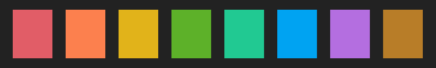
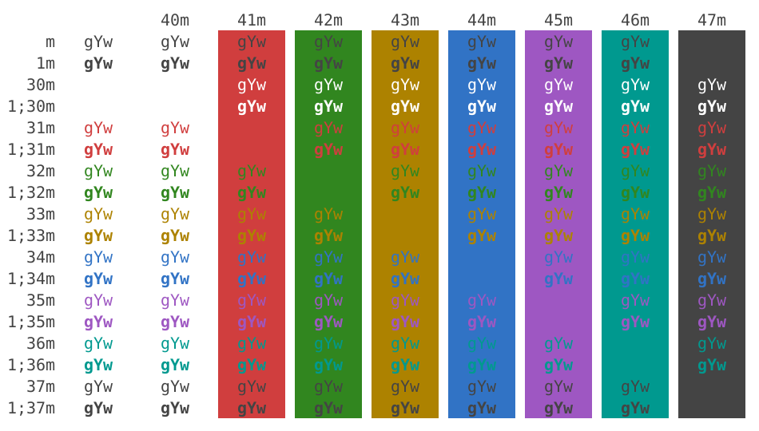
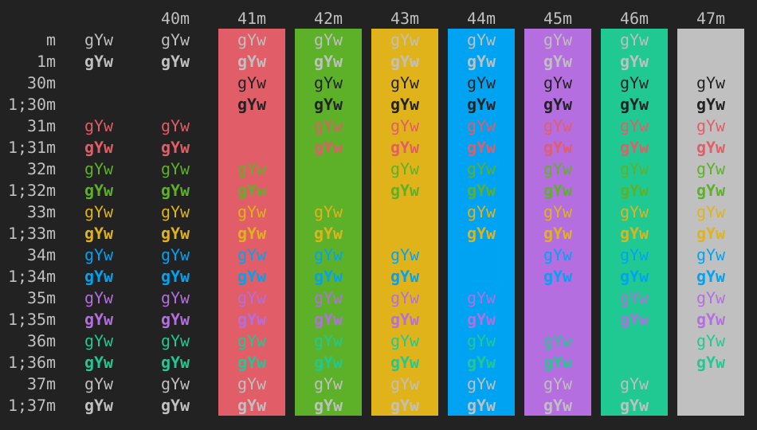

# Base16 standardized colorschemes

--- 

*A pair of [base16](https://github.com/chriskempson/base16) colorschemes designed with standards compliance and functionality in mind.*

--- 

 

---

## Why you might want to use these colorschemes ?  

Most colorschemes seem to be designed with esthetic considerations but can sometimes have poor standards when it comes to functionality. Here are the common issues I have in mind:

- Using **colors that don't contrast properly with the background**. For example yellow can be sometimes hard to read on a white background, or blue on a dark one.

- Using **colors that are too close to each other**. For example cyan is sometimes not different enough from blue, or magenta from red, etc.

- Using **inconsistent colors in terms of lightness and saturation**. For example magenta or cyan are sometimes very bright and pop a lot more on the screen than blue or green.

I do not claim that all these problems can be easily solved because **there are obvious trade offs**. For example, using inconsistent colors is a way of achieving a good distance between colors.

However I think that **a good colorscheme should stick to certain standards in terms of color distance, contrast and consistency**. I do not pretend to have the perfect solution which does not exist, but I managed to achieve some degree of good standards compliance and found some **functional middleground**

My goal here was not to add a special or original character to your terminal or your text editor but solely to provide an efficient and easy on the eyes color palette, by fixing for myself sane standards and sticking to them carefully. Anything estheticallly interesting that results from this should be seen mostly as a happy side effect of my fussy character.

---  

## Standards  

 

### Contrast standards  

For a good readability, it's important to have enough contrast between the foreground and the backgroud. Contrast standards are defined by the Web Content Accessibility Guideline (WCAG). You can check if these standards are met here : [contrast checker](https://webaim.org/resources/contrastchecker/)

Both versions of the colorscheme stick  to the following standards:

- **foreground** / background contrast: **AAA rating** 

- **comments** / background contrast: **AA rating** 

- **line numbers** / background contrast: **AA rating** 

- **accent colors** / background contrast: **AA rating**  in **dark mode** and a minimum ratio of **3.50:1 in light mode**

### Color distinctiveness standards  

To easily recognize each elements of a code, there should be enough distance between colors in the [CIELAB colorspace](https://en.wikipedia.org/wiki/CIELAB_color_space). This model aims at representing the difference in colors as they are actually percieved by a human observer. To design this colorscheme, I used the tool [I Want Hue](https://medialab.github.io/iwanthue/) where you can check the distances wtihin a color palette.

Both versions of the colorscheme stick to the following standards:

- The **average distance** between two colors of the palette shoud be **over 75**

- The **minimum distance** between two colors of the **8 colors** of the vim palette should be **over 30**

- The **minimum distance** between two colors of the **6 colors** of the terminal palette should be **over 40**

### Color consistency and balance  

Since you don't want some colors to pop out too much or to seems at odds compared to the rest, a good colorscheme should not use the whole possible range of lightness and saturation, but restrict itself within a certain range. This range can be checked using the HSL (Hue, Saturation, Lightnesse) representation of colors. What a colorscheme should aim at is great difference in hue without too much difference in Saturation and lightness. Again I used [I Want Hue](https://medialab.github.io/iwanthue/) to garanty that all the colors remain inside a certain range.

Both versions of the colorscheme stick to the following standards:

- All colors of the **light** colorscheme are within a the **35%-70%** range in **saturation** and whitin the **40%-60%** range in **lightness**

- All colors of the **dark** colorscheme are within the **50%-75%** range in **saturation** and whithin the **55%-80%** range in **lightness**

### base16 

In addition both colorschemes have a base16 "tomorrow-like" color palette (red, orange, yellow, green, cyan, blue, purple, brown, + shades of grey), so it can be easily used across a wide array of apps and environment. See for example [tint-theming](https://github.com/tinted-theming) and [base16](https://github.com/chriskempson/base16) for more info.

### Note on the light mode

As you can see, the light colorscheme has slightly lower standards overall. This is because it's harder to have both a good differentiation between colors and a good contrast, when you use a light background. On light background, you need to use darker colors to have enough contrast, but darker colors tend to be less distant to each other. Things get even worse when you try to use a grey or yellow as your background color (That's the main reason why I stick to white). Using a light background has several advantages though: it improves focus, the letters don't "bleed" as much, and your eyes don't need to acomodate when switching between a light website or pdf and your terminal. Personally I use light mode a lot and I have a hard time finding a colorscheme that suits me. I hope this one can be another useful option.
